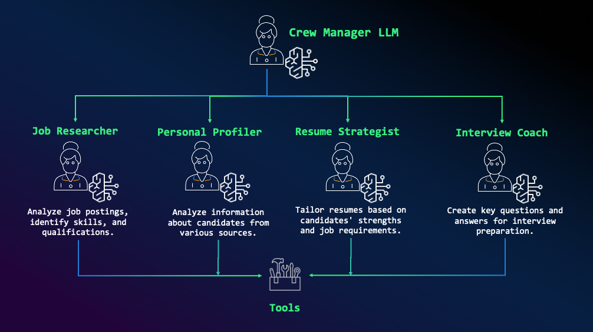

# 🤖 Multi-Agent AI Solutions

This repository contains two innovative projects that demonstrate the power of multi-agent AI systems for different real-world applications. Each project leverages AI agents to collaborate and solve complex tasks efficiently.

## 📂 Project Structure

```
multi-agent/
├── financial-analysis/    # AI agents for financial analysis and trading
└── jobhunting-crew/      # AI agents for resume optimization and job hunting
```

## 🚀 Projects Overview

### 1. Financial Analysis Agents

<p align="center">
  
</p>

A sophisticated multi-agent system designed for financial analysis and trading strategy development. The system employs four specialized agents working in collaboration:

* **Data Analyst Agent**: Processes and analyzes financial data
* **Trading Strategy Agent**: Develops market strategies
* **Trade Advisory Agent**: Provides execution recommendations
* **Risk Advisor Agent**: Manages risk assessment

**Key Features:**
* Integration with Anthropic Claude and other LLMs
* Extensible architecture for custom workflows
* Comprehensive financial data analysis
* Risk-aware trading recommendations

[Learn more about Financial Analysis Agents](./financial-analysis/README.md)

### 2. Job Hunting Crew

An AI-powered system that optimizes job applications and interview preparation using Amazon Bedrock and CrewAI. The system features four specialized agents:

<p align="center">
  
</p>

* **Job Researcher**: Analyzes job postings and requirements
* **Personal Profiler**: Evaluates candidate's strengths
* **Resume Strategist**: Tailors resumes to specific positions
* **Interview Coach**: Prepares interview Q&A

**Key Features:**
* Automated job requirement analysis
* Personalized resume optimization
* AI-driven interview preparation
* Modular and extensible architecture

[Learn more about Job Hunting Crew](./jobhunting-crew/README.md)


## 🚀 Getting Started

1. Clone the repository:
```bash
git clone https://github.com/your-username/multi-agent.git
cd multi-agent
```
# Python Environment Configuration with Caching

This repository provides a Python module `utils.py` for managing environment variables with caching, validation, and default configurations. It's designed to simplify handling environment-specific settings in your Python applications.

### Installation

No installation is needed since this is just a single Python file.  Simply place the `utils.py` (replace with the actual name of your script) in your project directory.


### Environment Variable Files

Rename `samples.env` to `.env` and update the API keys in those files.

You can customize the paths to these files using the `dotenv_paths` parameter in the `load_env` method:

```python
from utils import Environment  # Replace utils

Environment.load_env(dotenv_paths=['config/.env', '.env.defaults'])
```


## 📜 License

Both projects are licensed under the MIT License.

## 🤗 Contributing

Contributions are welcome! Feel free to open issues or submit pull requests to improve the solution.