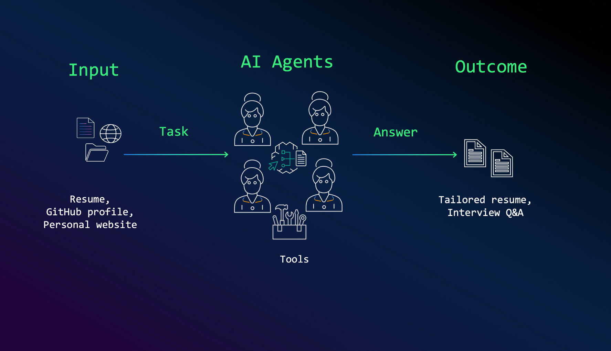

# 🚀 AI Agents for Resume Optimization

This repository demonstrates how **AI agents** can assist in **resume tailoring and interview preparation** by analyzing job postings, extracting relevant skills, and optimizing application materials. The **multi-agent system** leverages **Amazon Bedrock**, and **CrewAI** to automate resume enhancement and interview readiness.

<p align="center">
  
</p>

## 🌟 How It Works

The system takes in inputs like **resumes, GitHub profiles, and personal websites**, processes them using AI agents, and produces tailored resumes and interview Q&A to maximize job application success.

### **🔹 Agents & Responsibilities**
1. **Job Researcher** – Extracts key skills and qualifications from job postings.
2. **Personal Profiler** – Analyzes the candidate’s strengths from various online sources.
3. **Resume Strategist** – Customizes resumes based on the extracted insights.
4. **Interview Coach** – Generates key Q&A for interview preparation.

Each agent works in collaboration under a **Crew Manager LLM**, ensuring a structured workflow.

<p align="center">
  
</p>

---

## 📋 Prerequisites

Before running the code, make sure you have the following set up:

### 🔑 API Keys

1. **Serper API Key** (or other search APIs):
   - Sign up at [Serper](https://serper.dev/) to obtain an API key.
   - Add the key to the `.env` file as `SERPER_API_KEY`.

### 🔧 AWS Configuration

To access models on **Amazon Bedrock**, configure your AWS credentials by running:

```bash
aws configure
```
Follow the prompts to enter your AWS Access Key ID, Secret Access Key, Region, and Output format.


### ** Clone the Repository**
```bash
git clone https://github.com/viktoriasemaan/multi-agent.git
cd jobhunting-crew
```

# How to Use

1. Load job posting details (URL or text)
2. Provide your resume, GitHub profile, or personal site
3. Agents will analyze and optimize your resume
4. Receive a structured resume and interview Q&A


# License

This project is licensed under the **MIT License**.

## 🤗 Contributing

Contributions are welcome! Feel free to open issues or submit pull requests to improve the solution.