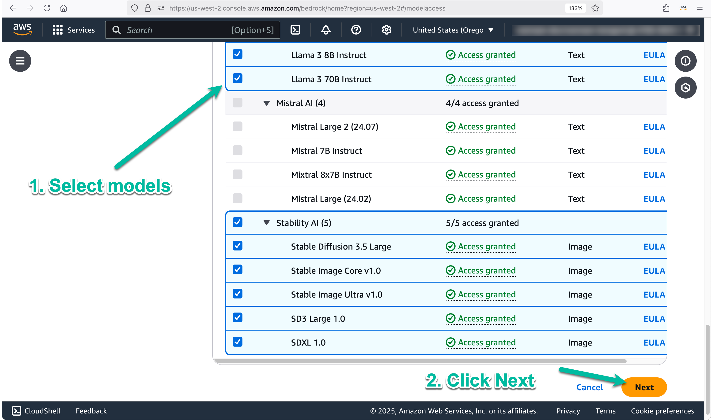
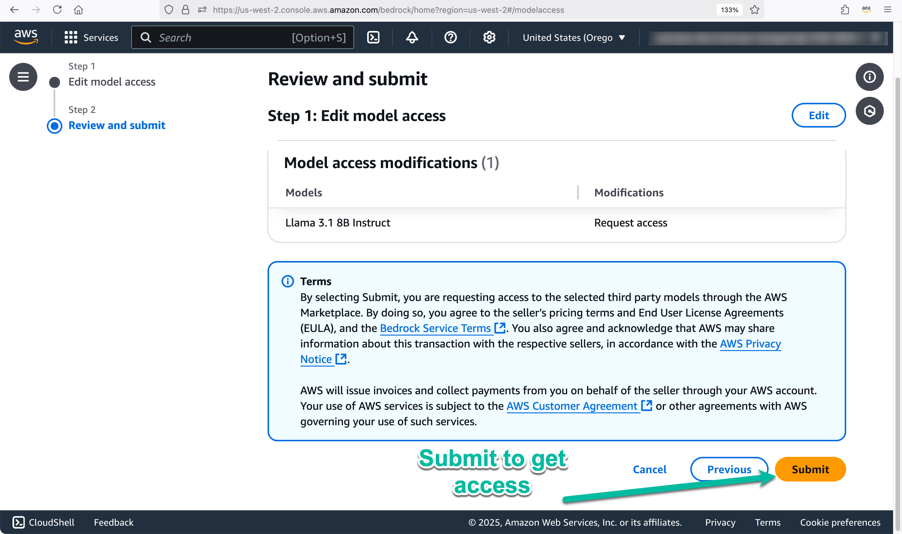

# 🚀 AI Agents for Resume Optimization

This repository demonstrates how **AI agents** can assist in **resume tailoring and interview preparation** by analyzing job postings, extracting relevant skills, and optimizing application materials. The **multi-agent system** leverages **Amazon Bedrock**, and **CrewAI** to automate resume enhancement and interview readiness.

<p align="center">
  
</p>

## 🌟 How It Works

The system takes in inputs like **resumes, GitHub profiles, and personal websites**, processes them using AI agents, and produces tailored resumes and interview Q&A to maximize job application success.

### **🔹 Agents & Responsibilities**
1. **Job Researcher** – Extracts key skills and qualifications from job postings.
2. **Personal Profiler** – Analyzes the candidate’s strengths from various online sources.
3. **Resume Strategist** – Customizes resumes based on the extracted insights.
4. **Interview Coach** – Generates key Q&A for interview preparation.

Each agent works in collaboration under a **Crew Manager LLM**, ensuring a structured workflow.

<p align="center">
  
</p>

---

## 📋 Prerequisites

Before running the code, make sure you have the following set up:

### ** Clone the Repository**
```bash
git clone https://github.com/viktoriasemaan/multi-agent.git
cd jobhunting-crew
```

### 🛠 Environment Setup

- Install the required libraries:
  ```bash
  pip install crewai crewai_tools anthropic litellm langchain_community
  ```

- Ensure Python 3.8+ is installed.

- Use either:
  - **Jupyter Notebook**: Install Jupyter Notebook and open the provided `.ipynb` file.
  - **VS Code (Jupyter Extension)**: Open the `.ipynb` file in [Visual Studio Code](https://code.visualstudio.com/) with the **Jupyter** extension for an integrated coding experience.  
  - **Google Colab**: Upload the `.ipynb` file to [Google Colab](https://colab.research.google.com/) for an easy-to-use cloud environment.
  - **Amazon SageMaker**: Use [Amazon SageMaker Studio](https://aws.amazon.com/sagemaker/studio/) for a managed and scalable machine learning environment.

### 🔑 API Keys

1. **Serper API Key** (or other search APIs):
   - Sign up at [Serper](https://serper.dev/) to obtain an API key.
   - Rename `sample.env` to `.env`
   - Add the key to the `.env` file as `SERPER_API_KEY`.

### 🔧 AWS Configuration

To use models on **Amazon Bedrock**, follow these steps:

### 1. Sign Up for an AWS Account (if you don’t have one)
- Create a free-tier AWS account at [AWS Free Tier](https://aws.amazon.com/free/).
- Ensure your account is fully activated before proceeding.

### 2. Install AWS CLI
- Download and install the AWS Command Line Interface (CLI) from the [AWS CLI Installation Guide](https://aws.amazon.com/cli/).
- Verify the installation by running:
  ```bash
  aws --version

### 3. Configure AWS Credentials

Run the following command to set up your AWS credentials:

```bash
aws configure
```

You will be prompted to enter:

- **AWS Access Key ID**
- **AWS Secret Access Key**
- **Default AWS Region** (e.g., `us-west-2`)
- **Output format** (default is `json`)

When selecting a region, choose one where Amazon Bedrock models are available. You can check model availability across different AWS regions in the official documentation [Supported Models and Regions](https://docs.aws.amazon.com/bedrock/latest/userguide/models-supported.html).
If models are available in multiple regions, select the one closest to you to minimize latency.

### 4. Request Access to Amazon Bedrock Models

Amazon Bedrock requires explicit access to specific foundation models.

- Navigate to the [Amazon Bedrock Console](https://aws.amazon.com/bedrock/) and request access to the models you want to use.  
- Some models may have limited availability based on your AWS region.  

Once access is granted, you can start using Amazon Bedrock models in your applications. 🚀

<p align="center">
  
</p>

<p align="center">
  
</p>

<p align="center">
  
</p>

# How to Use

1. Open AI_Agents_Resume.ipynb and execute the notebook.
2. Load job posting details (URL or text)
3. Provide your resume, GitHub profile, or personal site
4. Agents will analyze and optimize your resume
5. Receive a structured resume and interview Q&A


# License

This project is licensed under the **MIT License**.

## 🤗 Contributing

Contributions are welcome! Feel free to open issues or submit pull requests to improve the solution.